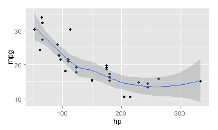

SSP Energy
========================================================
author: Jerome Hilaire
date: 12 November 2013


First Slide
========================================================

For more details on authoring R presentations click the
**Help** button on the toolbar.

- Bullet 1
- Bullet 2
- Bullet 3


$$f(x) = \frac{sin(x)^2}{x}$$


Slide With Code
========================================================


```r
summary(cars)
```

```
     speed           dist    
 Min.   : 4.0   Min.   :  2  
 1st Qu.:12.0   1st Qu.: 26  
 Median :15.0   Median : 36  
 Mean   :15.4   Mean   : 43  
 3rd Qu.:19.0   3rd Qu.: 56  
 Max.   :25.0   Max.   :120  
```


Slide With Plot
========================================================

 


Slide With ggplot2
========================================================

```r
library(ggplot2)
qplot(hp, mpg, data=mtcars)+geom_smooth() 
```

 

